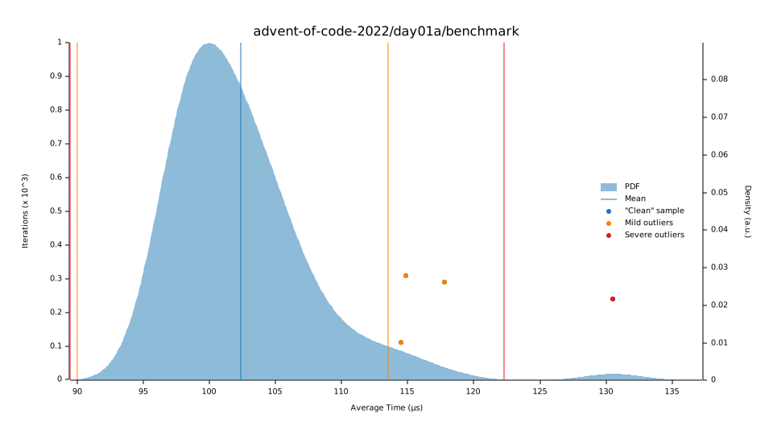
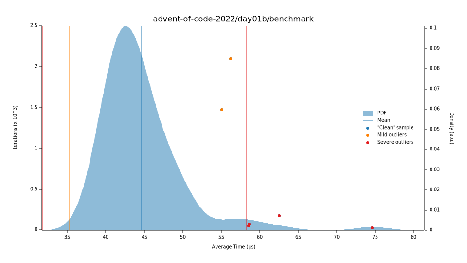
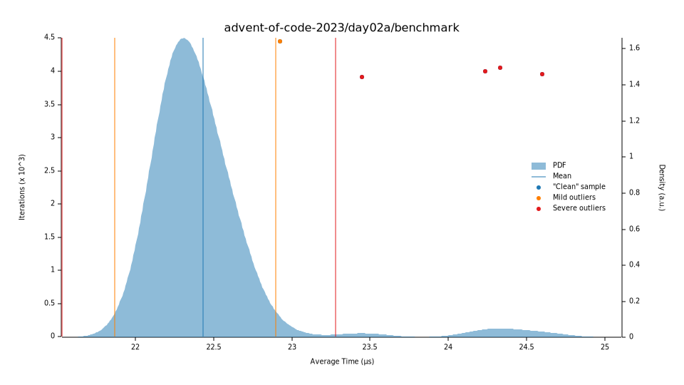
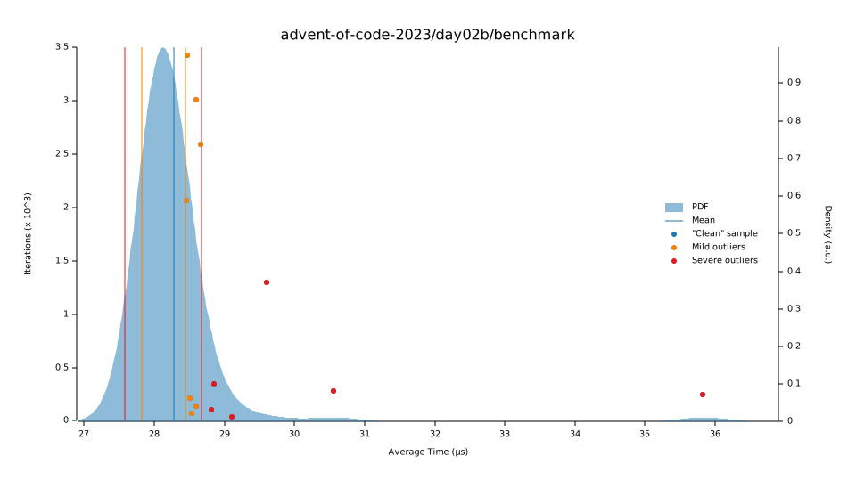
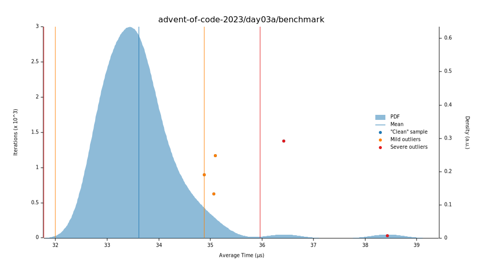

# Advent of Code 2023 in Rust

My [Advent of Code 2023](https://adventofcode.com/2023) solutions in [Rust](https://www.rust-lang.org/).

## Benchmarks

Below is how long each solution runs. All solutions are measured with [`benchmark_all.rs`](./benches/benchmark_all.rs), by 'warming up' for three seconds, and then collecting 100 samples for each benchmark. Not that the graphs matter or show anything interesting. I just like graphs. 

|                                                | part A                                                                                                                                            |                                                                      part B                                                                       |
|:-----------------------------------------------|---------------------------------------------------------------------------------------------------------------------------------------------------|:-------------------------------------------------------------------------------------------------------------------------------------------------:|
| [day 1](https://adventofcode.com/2023/day/1)   | <br/>[`[ 101.72 µs 102.52 µs 103.40 µs ]`](./src/days/day01a.rs) | <br/>[`[ 43.643 µs 44.621 µs 45.634 µs ]`](./src/days/day01b.rs) |
| [day 2](https://adventofcode.com/2023/day/2)   | <br/>[`[ 22.370 µs 22.522 µs 22.699 µs ]`](./src/days/day02a.rs) |               <br/>[`[ 28.094 µs 28.132 µs 28.177 µs ]`](./src/days/day02b.rs)                |
| [day 3](https://adventofcode.com/2023/day/3)   | <br/>[`[ 33.484 µs 33.606 µs 33.730 µs ]`](./src/days/day03a.rs)                              |                <br/>[`[ ]`](./src/days/day03b.rs)                |
| [day 4](https://adventofcode.com/2023/day/4)   | <br/>[`[ ]`](./src/days/day04a.rs)                               |                <br/>[`[ ]`](./src/days/day04b.rs)                |
| [day 5](https://adventofcode.com/2023/day/5)   | <br/>[`[ ]`](./src/days/day05a.rs)                               |                <br/>[`[ ]`](./src/days/day05b.rs)                |
| [day 6](https://adventofcode.com/2023/day/6)   | <br/>[`[ ]`](./src/days/day06a.rs)                               |                <br/>[`[ ]`](./src/days/day06b.rs)                |
| [day 7](https://adventofcode.com/2023/day/7)   | <br/>[`[ ]`](./src/days/day07a.rs)                               |                <br/>[`[ ]`](./src/days/day07b.rs)                |
| [day 8](https://adventofcode.com/2023/day/8)   | <br/>[`[ ]`](./src/days/day08a.rs)                               |                <br/>[`[ ]`](./src/days/day08b.rs)                |
| [day 9](https://adventofcode.com/2023/day/9)   | <br/>[`[ ]`](./src/days/day09a.rs)                               |                <br/>[`[ ]`](./src/days/day09b.rs)                |
| [day 10](https://adventofcode.com/2023/day/10) | <br/>[`[ ]`](./src/days/day10a.rs)                               |                <br/>[`[ ]`](./src/days/day10b.rs)                |
| [day 11](https://adventofcode.com/2023/day/11) | <br/>[`[ ]`](./src/days/day11a.rs)                               |                <br/>[`[ ]`](./src/days/day11b.rs)                |
| [day 12](https://adventofcode.com/2023/day/12) | <br/>[`[ ]`](./src/days/day12a.rs)                               |                <br/>[`[ ]`](./src/days/day12b.rs)                |
| [day 13](https://adventofcode.com/2023/day/13) | <br/>[`[ ]`](./src/days/day13a.rs)                               |                <br/>[`[ ]`](./src/days/day13b.rs)                |
| [day 14](https://adventofcode.com/2023/day/14) | <br/>[`[ ]`](./src/days/day14a.rs)                               |                <br/>[`[ ]`](./src/days/day14b.rs)                |
| [day 15](https://adventofcode.com/2023/day/15) | <br/>[`[ ]`](./src/days/day15a.rs)                               |                <br/>[`[ ]`](./src/days/day15b.rs)                |
| [day 16](https://adventofcode.com/2023/day/16) | <br/>[`[ ]`](./src/days/day16a.rs)                               |                <br/>[`[ ]`](./src/days/day16b.rs)                |
| [day 17](https://adventofcode.com/2023/day/17) | <br/>[`[ ]`](./src/days/day17a.rs)                               |                <br/>[`[ ]`](./src/days/day17b.rs)                |
| [day 18](https://adventofcode.com/2023/day/18) | <br/>[`[ ]`](./src/days/day18a.rs)                               |                <br/>[`[ ]`](./src/days/day18b.rs)                |
| [day 19](https://adventofcode.com/2023/day/19) | <br/>[`[ ]`](./src/days/day19a.rs)                               |                <br/>[`[ ]`](./src/days/day19b.rs)                |
| [day 20](https://adventofcode.com/2023/day/20) | <br/>[`[ ]`](./src/days/day20a.rs)                               |                <br/>[`[ ]`](./src/days/day20b.rs)                |
| [day 21](https://adventofcode.com/2023/day/21) | <br/>[`[ ]`](./src/days/day21a.rs)                               |                <br/>[`[ ]`](./src/days/day21b.rs)                |
| [day 22](https://adventofcode.com/2023/day/22) | <br/>[`[ ]`](./src/days/day22a.rs)                               |                <br/>[`[ ]`](./src/days/day22b.rs)                |
| [day 23](https://adventofcode.com/2023/day/23) | <br/>[`[ ]`](./src/days/day23a.rs)                               |                <br/>[`[ ]`](./src/days/day23b.rs)                |
| [day 24](https://adventofcode.com/2023/day/24) | <br/>[`[ ]`](./src/days/day24a.rs)                               |                <br/>[`[ ]`](./src/days/day24b.rs)                |
| [day 25](https://adventofcode.com/2023/day/25) | <br/>[`[ ]`](./src/days/day25a.rs)                               |                <br/>[`[ ]`](./src/days/day25b.rs)                |


## Run solutions
All implementations of puzzle solutions can be found inside [`./src/days/`](./src/days). The corresponding puzzle input can be found in [`./src/input/`](./src/input).

```bash
# Run all puzzles and print their solutions
cargo run

# Unit test all puzzles to see whether everything generates the correct answer 
cargo test

# or benchmark all puzzles
cargo bench
```

## License

This project is released under the GNU GPL-3.0 license.
Check out the [LICENSE](LICENSE) file for more information.